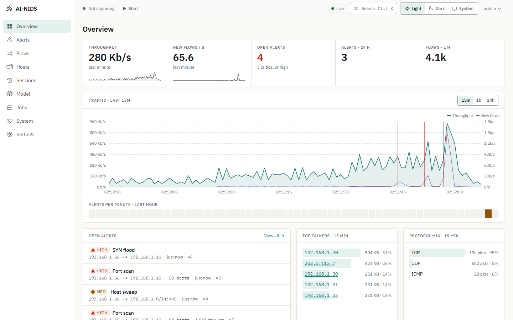
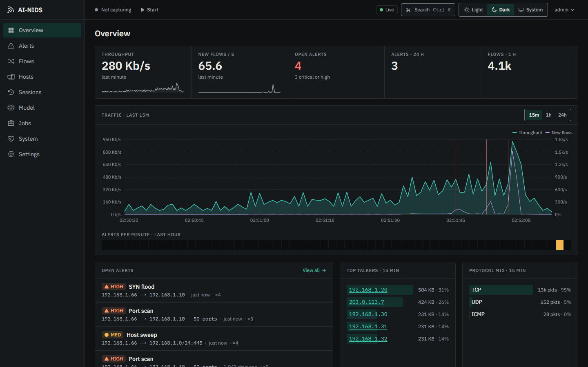
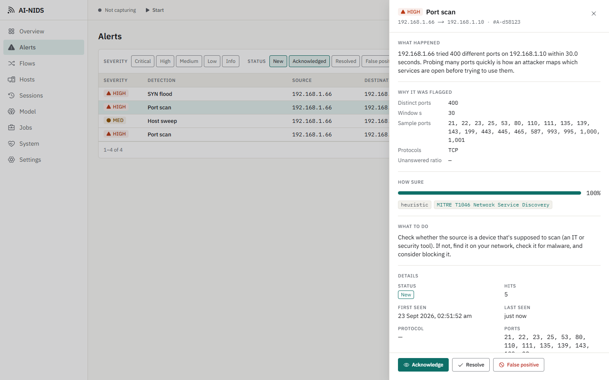
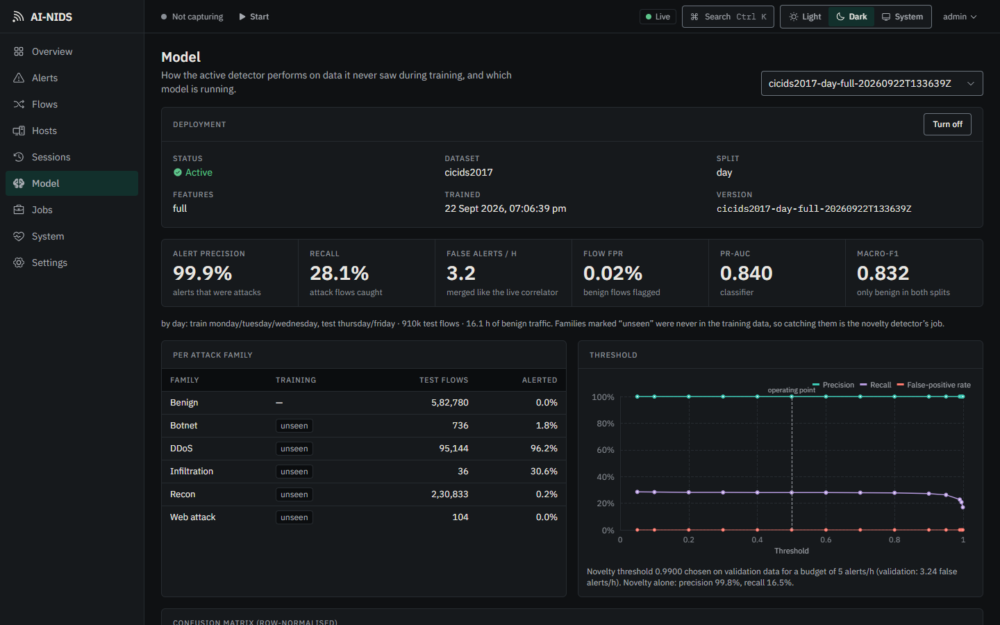

# AI-NIDS

A network intrusion detection system for one home, lab or small-office network. It turns live
traffic (or a PCAP file) into flows and checks each one three ways: a LightGBM classifier for
known attack families, a novelty detector fitted on benign traffic, and stateful scan, sweep and
flood rules. It explains every alert in plain language, in a web UI built for watching traffic.

The numbers below are measured on attacks the model never saw during training, and they're
published even where they're poor.

| Light | Dark |
|---|---|
|  |  |
|  |  |

## What it does

- **Live capture or replay.** Npcap on Windows, libpcap on Linux (NFStream at line rate, or
  Scapy), or any `.pcap`/`.pcapng` streamed through the same pipeline.
- **Flow-based detection.** Bidirectional flows with CICFlowMeter-compatible features
  ([feature schema](docs/features.md)), scored by:
  - a classifier for attack families it was trained on,
  - an out-of-envelope novelty detector for traffic unlike anything benign,
  - heuristics that catch port scans, host sweeps and SYN/UDP/ICMP floods within seconds.
- **Alerts an analyst can act on.** Repeats are merged per source and destination. Each alert
  shows why it was flagged, how sure the detector is, the MITRE ATT&CK technique and what to do
  next. Acknowledge, resolve, or mark it as a false positive, which adds a suppression rule.
- **A live UI.** Overview, alerts, flows, hosts, sessions, the model's test results, jobs and
  settings, all updated over one WebSocket. Light and dark themes, full keyboard use, and axe
  checks on every page.
- **Reports and notifications.** Session reports as HTML and PDF, CSV/JSON exports, email, signed
  webhooks (JSON, Slack, Discord), desktop notifications and a daily digest.
- **Secure by default.** The API listens on loopback only, with one argon2id-hashed admin
  account, CSRF tokens, a strict CSP, hash-verified models, and capture rights for the sensor
  process only ([threat model](docs/threat-model.md)).

## Results

From the [model card](docs/model-card.md). Trained on CIC-IDS2017 Monday–Wednesday and tested on
Thursday–Friday, whose attack families are all new to the model:

| Attack family (unseen in training) | ML alone | ML + heuristics |
|---|---|---|
| DDoS | 96.2% | 96.2% |
| Port scans (`recon`) | 0.2% | **99.8%** |
| Infiltration | 30.6% | 30.6% |
| Botnet | 1.8% | 1.8% |
| Web attacks | 0.0% | 0.0% |
| **False alerts per hour of benign traffic** | 3.2 | **3.7** |

- Alert precision is 99.9%, and 28.1% of attack flows are flagged by ML alone.
- On a random split, the setting most papers report, the same pipeline scores 100% recall and
  0.997 PR-AUC. That's an upper bound, not a realistic figure.
- Trained on CIC-IDS2017 and tested on UNSW-NB15, it catches 8.1% of attacks. It doesn't
  generalise to a different network, which is why the heuristics exist and why the novelty
  detector should be refitted on your own traffic.

## Quickstart

### Docker (Linux), about a minute

```bash
git clone https://github.com/AHILL-0121/AI-NIDS.git && cd AI-NIDS
docker compose -f docker/compose.yml up -d --build
```

1. Open <http://127.0.0.1:8000> and create the admin account.
2. Go to **Jobs** and upload `backend/tests/fixtures/pcaps/nmap_syn_scan.pcap` (or the flood or
   sweep captures next to it).
3. Turn on **Replay as if captured just now**, then press **Replay**. The port-scan alert appears
   on **Alerts** and the traffic appears on **Overview**.

For live capture on a Linux host, add the sensor:
`NIDS_INTERFACE=eth0 docker compose -f docker/compose.yml --profile capture up -d`.

### Native (Windows, Linux, macOS)

Needs Python 3.12 with [uv](https://docs.astral.sh/uv/), and Node 22.

```bash
cd frontend && npm ci && npm run build && cd ..
cd backend && uv sync --all-extras
uv run nids doctor     # can this machine capture? what to fix if not
uv run nids api        # http://127.0.0.1:8000
```

Windows needs [Npcap](https://npcap.com) for live capture. See
[backend/README.md](backend/README.md#running-on-windows) for elevated and unelevated setups.

### A model

The repository contains no trained models: the datasets are licensed and too large to commit.
Without a model, detection runs on the heuristics alone. To train one, download the data as
described in [backend/data/README.md](backend/data/README.md), then:

```bash
cd backend
uv run nids data prepare cicids2017 --src data/raw/cicids2017
uv run nids train --dataset cicids2017 --protocol day
```

Activate it on the **Model** page. You can also start both steps from **Jobs**.

## Repository map

```
backend/            Python 3.12 package `nids`: sensor, ML, API, storage, CLI  (backend/README.md)
  src/nids/sensor/    capture, flow table, detectors
  src/nids/ml/        dataset loaders, training, evaluation, model registry
  src/nids/api/       FastAPI app, auth, WebSocket, job supervisor
  src/nids/store/     SQLAlchemy models and migrations
  tests/              pytest, with labelled PCAP fixtures
frontend/           Next.js static export: pages, design system, charts  (frontend/README.md)
docker/             compose.yml (api + opt-in sensor)
docs/               architecture, feature schema, model card, threat model
.github/workflows/  backend, frontend, e2e and docker CI
```

## Documentation

- [Architecture](docs/architecture.md): processes, detection path, API, storage
- [Model card](docs/model-card.md): data, evaluation protocol, all results, limitations
- [Feature schema](docs/features.md): the 46 features and how each dataset maps onto them
- [Threat model](docs/threat-model.md): STRIDE for the sensor, API and UI

## Limitations

- New attack families are mostly missed by the ML (see Results). The heuristics cover scans,
  sweeps and floods, but not botnet or web-attack traffic.
- The shipped novelty baseline comes from lab traffic. Expect more novelty alerts on a real
  network until it's refitted on your own benign traffic (no tooling for that ships yet).
- Single user, single machine. SQLite is the only tested database, and there's no built-in TLS.
- Live NFStream capture is written and unit-tested but hasn't yet run on a real Linux interface.

## History

v1 of this project claimed 82–85% accuracy. An audit showed that number was the chance baseline:
the model had been trained on random data. v2 is a rewrite built to be measured honestly.
v1 is kept in the tag `v1-legacy`.

## License and citations

Code: [MIT](LICENSE). The datasets have their own terms (UNSW-NB15 is for academic research only)
and are not distributed here. If you use the results, cite the datasets:

- G. Engelen, V. Rimmer, W. Joosen. *Troubleshooting an Intrusion Detection Dataset: the CICIDS2017
  Case Study.* IEEE Security and Privacy Workshops (WTMC), 2021.
- I. Sharafaldin, A. H. Lashkari, A. A. Ghorbani. *Toward Generating a New Intrusion Detection
  Dataset and Intrusion Traffic Characterization.* ICISSP, 2018.
- N. Moustafa, J. Slay. *UNSW-NB15: a comprehensive data set for network intrusion detection
  systems.* Military Communications and Information Systems Conference (MilCIS), 2015.
