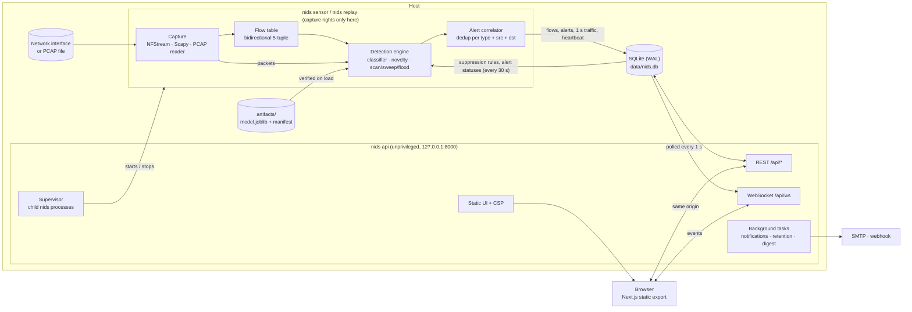
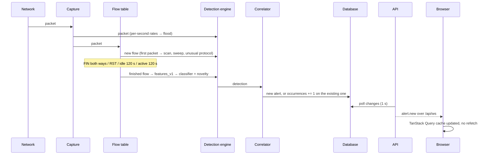

# Architecture

AI-NIDS is two processes that share one SQLite database, plus a static web UI served by one of
them.

## Processes



| Process | Command | Privileges | Job |
|---|---|---|---|
| Sensor | `nids sensor -i <interface>` | Raw capture (Npcap, or NET_RAW + NET_ADMIN) | Capture, build flows, detect, write to the database |
| Replay | `nids replay file.pcap` | None | The same pipeline fed from a PCAP file, at 1× or full speed |
| API | `nids api` | None | REST + WebSocket, auth, jobs, notifications, serves the UI |
| Jobs | `nids train`, `nids data prepare`, `nids report` | None | Started by the API as child processes, each with its own log file |

By default the API starts and stops the sensor itself, as a child process. When the sensor needs
different privileges from the API (Docker's `sensor` service, or Windows with Npcap restricted to
Administrators), it runs as its own service with `--active-model`, and the API runs with
`NIDS_EXTERNAL_SENSOR=true`. The API then reports the sensor's state from its heartbeat and never
tries to start or stop it.

## The detection path



1. **Capture** turns packets into `PacketMeta` (header fields only). Three sources share one
   interface: `NfstreamSource` (Linux, C speed, flows only), `LiveScapySource` (anywhere, packets
   and flows), and `PcapReplaySource` (streams a file, never loads it whole).
2. **Flow table** (`sensor/flows.py`) groups packets into bidirectional flows with CICFlowMeter
   statistics, and has a size cap with LRU eviction.
3. **Detection engine** (`sensor/detect/`) feeds each detector what it needs:
   - `ScanDetector` counts distinct ports per destination and hosts per subnet from each new
     flow's first packet, so a scan alerts within seconds instead of at flow timeout.
   - `FloodDetector` compares per-destination SYN and UDP/ICMP rates with an EWMA baseline every
     second. It needs packets, so it's off with NFStream.
   - `MlDetector` scores finished flows with the active model (see the
     [model card](model-card.md)).
   - An allow-list catches unusual IP protocols. Multicast and broadcast never count towards
     scans or sweeps.
4. **Correlator** (`sensor/detect/correlator.py`) merges repeats of the same `(type, src, dst)`
   within 15 minutes into one alert, raising `occurrences`, `last_seen`, severity and evidence.
   It applies suppression rules created by "false positive" decisions.
5. **Pipeline** (`sensor/pipeline.py`) writes flows, alerts and per-second traffic counters. Every
   30 s it reloads suppression rules and alert statuses set in the UI.

Every alert carries its evidence (heuristic counters, or the features that fell outside the benign
envelope), a MITRE ATT&CK technique, a plain-language explanation, what to do next, and the model
version that raised it.

## API

`backend/src/nids/api/` is a FastAPI app built by `create_app()`:

| Module | Covers |
|---|---|
| `auth.py` | First-run setup, argon2id login, session cookie, CSRF, login rate limit |
| `routes/sensor.py` | Capabilities, interfaces, status, start/stop |
| `routes/data.py` | Alerts, flows, sessions, stats, CSV/JSON export |
| `routes/admin.py` | Settings, suppressions, uploads, jobs, logs, audit |
| `models.py` | Model registry: list, activate (hash-verified), report |
| `routes/reports.py` | Session reports (HTML/PDF) |
| `routes/notifications.py` | Email/webhook settings and test sends |
| `ws.py` | `/api/ws`: `alert.new`, `alert.updated`, `stats.tick`, `sensor.state`, `job.progress` |
| `supervisor.py` | Child `nids` processes, graceful stop, recovery after a restart |
| `web.py` | The static UI with a per-page CSP and security headers |

Errors use one envelope, `{"error": {"code", "message", "details"}}`. The schema is at
`/api/openapi.json`, and interactive docs are at `/api/docs`. The frontend's TypeScript types are
generated from that schema, and CI fails if they're stale.

Background tasks inside the API process: the WebSocket broadcaster (1 s), notifications (3 s),
the daily retention job, and the optional daily digest.

## Storage

SQLAlchemy 2 models in `store/models.py`, with migrations in `store/migrations/` (Alembic, applied
at startup):

| Table | Holds |
|---|---|
| `sessions` | One row per capture or replay: interface or file, times, counters, status |
| `flows` | Finished flows: endpoints, counts, end reason and full flow statistics (kept 7 days) |
| `alerts` | Alerts with evidence, status, note and notification state (kept 90 days) |
| `traffic` | Per-second counters, rolled up to per-minute rows |
| `models` | Registered model artifacts, with hashes and summary metrics |
| `settings` | Runtime settings, the active model, the sensor heartbeat |
| `suppression_rules` | Rules created by false-positive decisions |
| `jobs`, `uploads` | Background jobs and uploaded PCAPs |
| `users`, `auth_sessions` | The admin account and hashed session tokens |
| `audit_log` | Who changed what, and when |

On disk, under `backend/` (or `/data` in Docker):

```
data/nids.db          the database (WAL)
data/uploads/         uploaded PCAPs, stored by id
data/jobs/            one log file per job
data/reports/         generated session reports (HTML, PDF)
data/logs/api.log     rotating API log
artifacts/<version>/  model.joblib, manifest.json, report.json, model_card.md
```

## Frontend

`frontend/` is a Next.js App Router app, exported as static files (`npm run build` → `out/`) that
the API serves. It has no Node server in production.

- **Pages:** Overview, Alerts (with a detail drawer), Flows, Hosts, Sessions, Model, Jobs (upload,
  replay, train), Settings and System, plus Login and the first-run Setup wizard. Detail views use query
  parameters (`/alerts?id=…`), because a static export has no dynamic server routes.
- **Data:** `lib/api/client.ts` (a typed `openapi-fetch` client that sends the CSRF token on
  writes) and `lib/queries.ts` (TanStack Query hooks). `lib/live.tsx` holds the one WebSocket,
  reconnects with backoff, and writes events into the query cache.
- **Design system:** React Aria Components plus tokens in `design/tokens.css`, light and dark.
  Charts use ECharts, themed from the same tokens.

## Deployment

| Where | How |
|---|---|
| Linux, Docker | `docker/compose.yml`: an unprivileged `api` service, plus a `sensor` service (profile `capture`) with host networking and only NET_RAW + NET_ADMIN. Both run from one image. |
| Windows | Native, with Npcap. See [`backend/README.md`](../backend/README.md#running-on-windows). |
| Development | `uv run nids api` plus `npm run dev` (port 3000, proxies `/api` to 8000) |

CI (`.github/workflows/`): `backend.yml` (ruff, mypy, pytest with coverage gates), `frontend.yml`
(eslint, prettier, tsc, vitest, build), `e2e.yml` (API client freshness, then Playwright + axe
against the real API) and `docker.yml` (build and smoke-test the image, and publish it to GHCR on
version tags).
